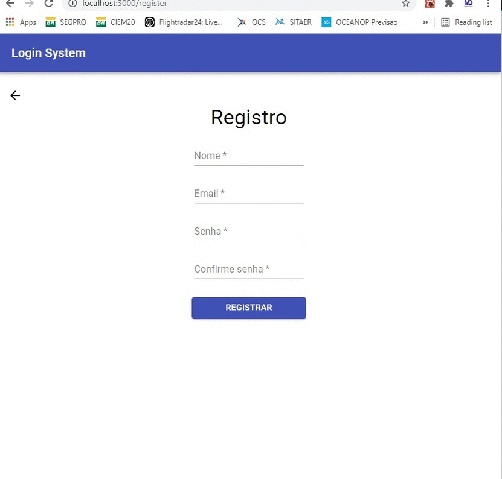

# React Material-ui Sistema de Autenticação

Este projeto foi criado com a intenção de servir como base para novos trabalhos, é um ponto de partida para criação de aplicativos devido a constante necessidade de
autenticação e registro de usuários. Material-ui é usado para lidar com a parte visual e no gerenciamento de estado no React usei o contexto.

As rotas são criadas com Node e Express e o Banco de dados é o MongoDB atlas.

<br />


## Instalação

```bash
npm install
```

## Ambiente de desenvolvimento
```bash
npm run dev
```

## Licença
[MIT](https://choosealicense.com/licenses/mit/)
